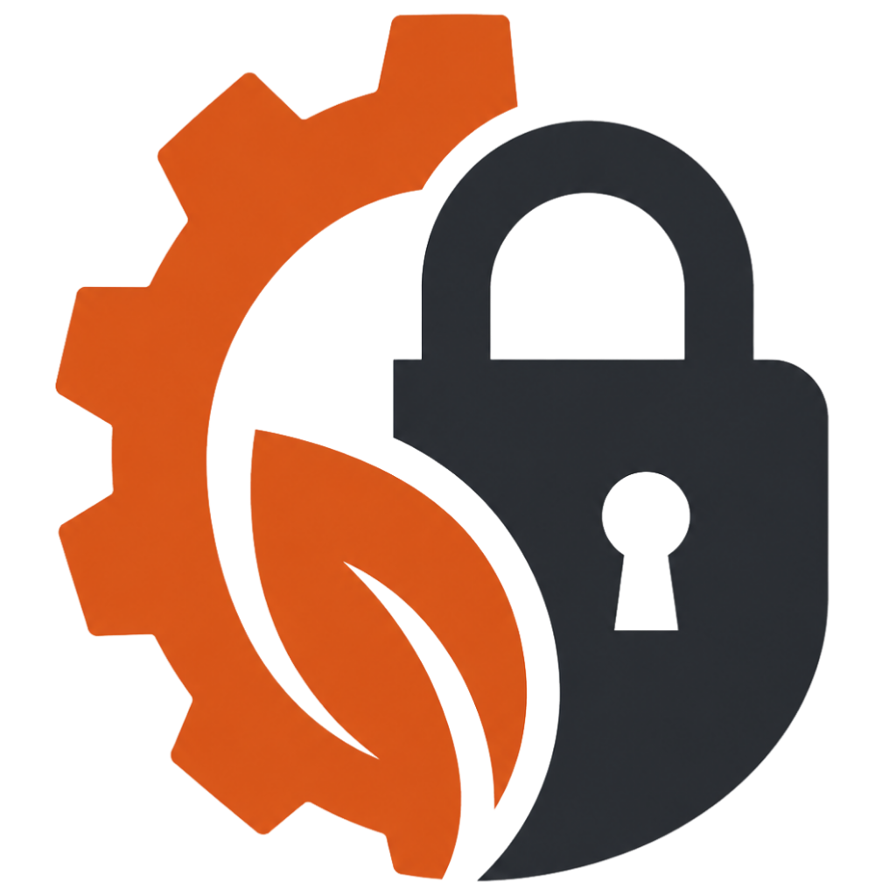
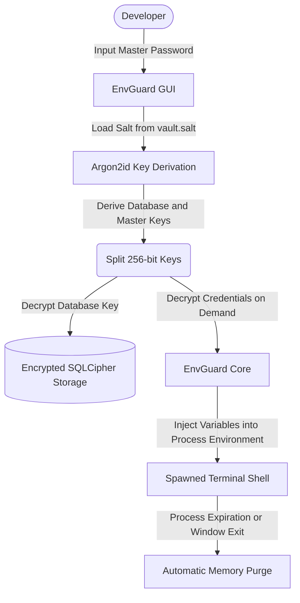
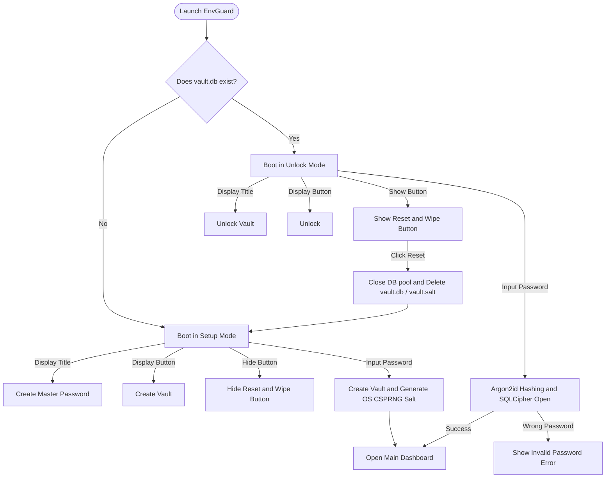

<p align="center">
  
</p>

# EnvGuard

### Modern, Native, Cross-Platform Developer Secrets and Environment Runtime Manager

<p align="center">
  <a href="https://github.com/0xarchit/EnvGuard/releases">
    
  </a>
  <a href="https://github.com/0xarchit/EnvGuard/actions">
    
  </a>
  <a href="https://github.com/0xarchit/EnvGuard/releases">
    
  </a>
  <a href="LICENSE">
    
  </a>
  <a href="https://rust-lang.org">
    
  </a>
</p>

EnvGuard is a secure local runtime-based credential management system designed to completely replace unencrypted, risky dot-env files. Developers manage application environment secrets through a GPU-accelerated desktop interface that groups credentials into cryptographically isolated project profiles. Environment variables are dynamically injected into memory space solely when terminal sessions are spawned, vanishing instantly once the shell session exits.

---

## The Liability of Plaintext Environment Files

Storing application secrets in dot-env files introduces severe vulnerabilities into modern development environments:

1. **Plaintext Storage**: Sensitive tokens sit unencrypted on local disks, completely exposed to host process scanning or physical extraction.
2. **Repository Exposure**: Accidents during git commits expose unencrypted configurations to public repositories, requiring instant credential rotations.
3. **No Lifecycle Control**: Plaintext secrets persist indefinitely on disk or in shell process environments, leaving them exposed across background tasks.
4. **Bypassed Audits**: Access control is unmonitored; there are zero audits recording when or what application requested a credential.

EnvGuard introduces a secure, ephemeral runtime architecture. Environment variables behave like temporary, authenticated sessions rather than permanent plaintext disk files.

---

## Core Security and Architecture Features

### Zero-Plaintext Memory Model
Decrypted credentials are kept in memory for the shortest time possible. The Slint desktop client displays masked indicators by default. Plaintext secrets are fetched dynamically on-demand only when clicking Reveal or Copy, and are instantly purged from the memory space when clicking Hide.

### SQLCipher Database Encryption at Rest
All profile configurations and credential metadata are stored in a local SQLite database compiled with static SQLCipher support. Page-level encryption guarantees complete protection at rest.

### Offline-First Cryptographic Isolation
Master encryption keys are derived using the Argon2id key derivation function with customized memory parameters. To protect page 0 of the SQLite database and allow safe bootstrap sequences, database salts are isolated in an external dot-salt file, ensuring a zero-plaintext sqlite header block.

### Session Lifetime Controls and Allowed Shells
Define automated session lifetimes directly from the GUI configurator. Secrets automatically expire and disappear from active shells once the specified timer runs out. Additionally, enforce terminal restrictions, ensuring profiles are only loaded inside specific shell environments (e.g. Bash or PowerShell).

### ConPTY Windows Fallbacks
To provide stability across older Windows environments, the spawner automatically checks ConPTY capabilities, dynamically falling back to standard pipe-redirected child processes when pseudo-terminals are unsupported.

---

## Architecture Flow

The following diagram illustrates how EnvGuard processes user credentials, manages local SQLCipher storage, and injects variables directly into terminal processes:



---

## User Experience Flow

The following flowchart describes the initialization, unlocking, and factory-reset lifecycles of the application vault:



---

## Technical Architecture

* **Rust**: Memory-safe, highly optimized, and compiled directly to platform-native executables.
* **Slint UI**: GPU-accelerated, lightweight graphical interface that consumes less than 30MB of RAM.
* **SQLCipher**: Strong 256-bit AES database encryption.
* **Zeroize**: Clears sensitive cryptographic keys and plaintexts directly from RAM.
* **Tokio**: Scalable asynchronous runtime managing background process lifecycles.
* **Arboard**: Secure clipboard manager.

---

## Installation and Platform Packages

EnvGuard is distributed as a platform-native installer rather than raw binaries. Choose the installer matching your development machine:

| Operating System | Native Package Formats | Installation Method |
| :--- | :--- | :--- |
| **Windows** | .msi (WiX), .exe (NSIS) | Run the setup wizard to register Start Menu shortcuts and paths |
| **macOS** | .dmg (Disk Image), .app bundle | Open DMG and drag EnvGuard.app into your Applications folder |
| **Linux** | .deb package, .AppImage | Install deb via dpkg or run the portable AppImage natively |

Download the latest version directly from our Releases page.

---

## macOS Gatekeeper Bypass Instructions

Because EnvGuard is built as independent open-source software, compiled release packages are not signed with a paid Apple Developer ID certificate. Consequently, macOS Gatekeeper may block execution during the first launch with a warning indicating that the software is unsigned or damaged.

To bypass this OS restriction and register EnvGuard natively, run the following terminal command after dragging the app to your Applications folder:

```bash
xattr -r -d com.apple.quarantine /Applications/EnvGuard.app
```

Once this quarantine flag is removed, you can launch EnvGuard natively via Spotlight or the Applications launcher.

---

## Developer Quickstart

To run a secure, temporary runtime environment:

1. Launch EnvGuard and unlock your vault using your master password.
2. Select your project profile in the navigation dashboard.
3. Configure the session rules, allowed shells, and environment variables.
4. Click Start Session to spawn your chosen shell process with credentials automatically loaded.
5. Once your work is finished, simply exit the terminal window. All injected environment secrets are cleared from system memory automatically.

---

## License

EnvGuard is licensed under the Apache License, Version 2.0. See the LICENSE file for the full license text.
